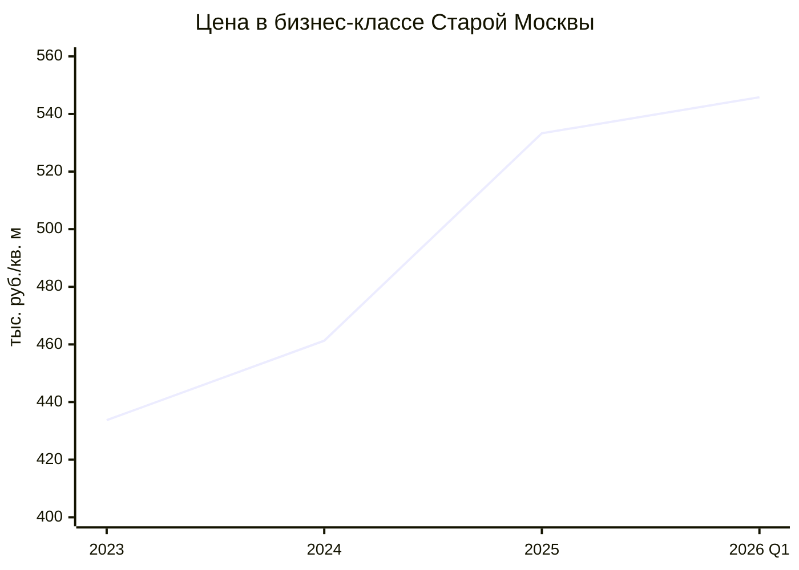
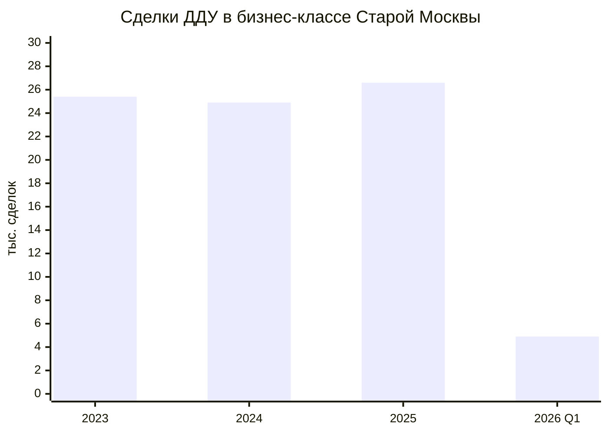
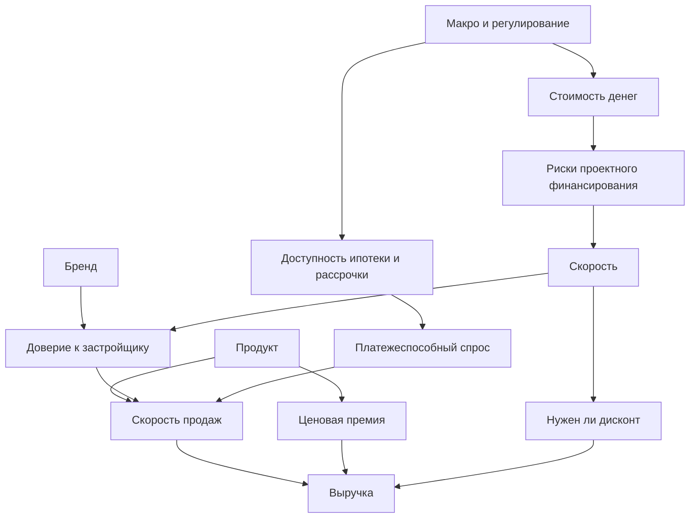

# Что определяет успех девелопера в бизнес-сегменте Москвы сейчас

## Executive summary

За последние три года ответ на вопрос «что важнее — бренд, скорость или продукт?» для московского бизнес-класса стал заметно менее спорным. На уровне **устойчивого коммерческого успеха** сейчас выигрывает прежде всего **продукт**, затем **бренд**, а затем **скорость**. Но в условиях дорогих денег скорость перестала быть просто операционной метрикой: она стала фильтром доверия для покупателя, банка и партнёров. Это видно по тому, как рынок пережил отмену широкой льготной ипотеки, высокую ключевую ставку и разворот к рассрочкам: лучше всего чувствовали себя те девелоперы, у кого совпали три элемента — сильный продукт, узнаваемая репутация и дисциплина по стройке. citeturn33view1turn37view0turn37view1turn23search0turn24search2

Рынок бизнес-класса в Старой Москве оказался заметно устойчивее, чем первичный рынок столицы в целом. В сегменте число ДДУ выросло с 25,4 тыс. в 2023 году до 26,6 тыс. в 2025 году, а средневзвешенная цена метра — с 433,7 тыс. руб. до 533,3 тыс. руб. За тот же период общий объём первичных ДДУ по Москве к 2025 году снизился до 122,9 тыс., то есть был на 10,3% ниже 2024 года и на 26,1% ниже 2023 года. Иными словами, в дорогой денежной среде капитал и платёжеспособный спрос сместились в более качественный и более «надёжно воспринимаемый» продукт. citeturn13view0turn14view0turn15view0turn6search12

Покупатель бизнес-класса сейчас — это уже не абстрактный «инвестор с хорошим доходом», а довольно конкретный профиль: в первом полугодии 2025 года основной группой были семьи 34–44 лет; около 90% сделок пришлись на жителей Москвы и Подмосковья; важнейшими параметрами выбора стали близость к метро, школы и детские сады, приватность, безопасность, зелёные общественные зоны, лобби и пространства для удалённой работы. Дополнительно рынок демонстрирует дефицит семейного формата: 74% потенциальных покупателей бизнес-класса — родители с несовершеннолетними детьми, ищущие квартиру минимум с двумя комнатами, тогда как доля таких лотов в предложении за три года снизилась до 49,1% с 63,1%. Это сильный аргумент в пользу того, что именно продукт, а не только маркетинг, определяет устойчивый спрос. citeturn33view1turn34search11turn34search10

По квази-количественной оценке этого отчёта, если рассматривать **только управляемые девелопером факторы**, их вклад в успех сегодня распределяется так: **продукт — около 45%**, **бренд — около 30%**, **скорость — около 25%**. Если же считать и внешнюю среду, то макроэкономика и регулирование добавляют ещё примерно четверть объясняющей силы к итоговому результату рынка в целом. Это не эконометрическая регрессия, а нормализованная аналитическая оценка по открытым данным о цене, скорости продаж, дисциплине ввода, покупательских предпочтениях и репутационных сигналах. citeturn33view1turn37view0turn37view1turn27search1turn24search2

## Контекст рынка и методика

Эмпирическая база отчёта опирается прежде всего на данные entity["organization","Метриум","real estate analytics"], entity["organization","Росреестр","Russian property registry"], entity["organization","Банк России","central bank"], entity["organization","ДОМ.РФ","housing institute"], entity["organization","ЕРЗ.РФ","developer ratings"], entity["organization","CORE.XP","real estate consultancy"] и entity["organization","Ромир","research holding"], а также на официальные сообщения девелоперов. Ключевое методическое ограничение: большая часть публично сопоставимых рядов по бизнес-классу публикуется для **Старой Москвы**, то есть без Новой Москвы и, как правило, без отдельного фокуса на Зеленоград. Поэтому именно Старая Москва используется как основной объект сегментного анализа; где возможно, в текст добавлен более широкий московский контекст. Период — 2023–2025 годы с текущим срезом на I квартал 2026 года. citeturn12view0turn14view0turn15view0turn38search0turn39search0

| Период | Средневзвешенная цена, тыс. руб./кв. м | Сделки ДДУ | Предложение / вывод новых проектов | Ключевой вывод |
|---|---:|---:|---|---|
| 2023 | 433,7 | 25,4 тыс. | 17 новых проектов; 75 введённых корпусов | Сегмент отыграл отложенный спрос; IV квартал держался на ипотеке, а сентябрь стал рекордным по сделкам. citeturn12view0turn13view0 |
| 2024 | 461,3 | 24 911 | 27 новых проектов; 23 194 лота на конец года | Спрос просел лишь на 3%, несмотря на отмену льготной ипотеки и дорогие кредиты; рынок адаптировался через рассрочки. citeturn14view0turn41view2 |
| 2025 | 533,3 | 26 595 | 18 новых проектов; 111 новых корпусов, что на 21% меньше, чем годом ранее | На фоне дорогого проектного финансирования девелоперы сократили запуски, но сегмент сохранил продажи и ускорил рост цен. citeturn15view0turn15view2turn16view0 |
| I кв. 2026 | 545,8 | 4,9 тыс. | 21,2 тыс. лотов; 138 проектов | Сегмент остается дорогим и крупным, но год к году продажи и выручка уже снижаются. citeturn35search3turn38search0 |

Географически устойчивый центр тяжести спроса сместился в южные и западные макролокации. В 2023 году максимальная доля сделок в бизнес-классе пришлась на ЮАО — 24%; в 2024 году лидерство ЮАО сохранилось за счёт проектов Shagal, Wave и «ЗИЛАРТ»; в 2025 году ЮАО снова был первым с 21% сделок, а второе и третье места заняли СЗАО и ЗАО с 17% каждый. Фактически бизнес-класс сейчас концентрируется там, где сочетаются масштабная редевелопмент-логика, доступ к метро и возможность сделать «город в городе»: прежде всего это entity["place","Даниловский район","Moscow, Russia"], entity["place","Хорошёво-Мнёвники","Moscow, Russia"], entity["place","Раменки","Moscow, Russia"] и entity["place","Покровское-Стрешнево","Moscow, Russia"]. citeturn13view0turn41view1turn16view0

## Что происходило со спросом, ценами и финансированием

С 2023 по 2025 год бизнес-класс дорожал быстрее, чем росло число сделок. Цена поднялась примерно на 23% за два года, тогда как число ДДУ выросло примерно на 4,7%. Это важный маркер: успех в сегменте определялся не только объёмом продаж, но и способностью удерживать или наращивать **ценовую премию**. В начале 2026 года инерция подорожания ещё сохранялась: средняя цена в I квартале достигла 545,8 тыс. руб./кв. м, но число сделок уже было на 21,1% ниже, чем годом ранее, а квартальная выручка сегмента сократилась на 7,3%. citeturn13view0turn14view0turn15view0turn38search0

То, что сегмент держался лучше рынка в целом, напрямую связано с макроциклом. В 2024 году, по официальным данным столичного Росреестра, число ипотечных ДДУ на первичном рынке Москвы составило 71 796, а их доля в общем объёме первичных сделок была 52,4%; при этом к 2025 году ипотечных ДДУ стало 55 809, а общий рынок новостроек сократился до 122 930 ДДУ. На рынке бизнес-класса зависимость от субсидируемой ипотеки ниже, поэтому после сворачивания широкой льготной ипотеки сегмент быстрее адаптировался — через рассрочки, комбинированные семейные программы и переориентацию на более обеспеченного локального покупателя. citeturn17search6turn17search13turn14view2turn41view2

Денежно-кредитная среда была для рынка жёсткой. Совет директоров Банка России 21 марта 2025 года оставил ключевую ставку на уровне 21%, 25 июля 2025 года снизил её до 18%, а 20 марта 2026 года — до 15%; на 17 апреля 2026 года ставка оставалась 15%. Для бизнес-класса это означало сразу два эффекта: рост стоимости проектного финансирования для девелопера и почти заградительную рыночную ипотеку для части покупателей. Именно поэтому в 2024 году, по оценке рынка, доля ипотечных сделок в бизнес-классе сократилась примерно вдвое — с 65% до 32%, а к 2025 году основной адаптационный инструмент сместился в рассрочки и более сложные финансовые схемы. citeturn39search1turn39search15turn39search13turn39search0turn41view2

Финансовая «подушка» спроса сместилась с ипотеки на рассрочку. По данным с отсылкой к статистике entity["organization","ЦИАН","real estate platform"] и ДОМ.РФ, доля рассрочки в общем портфеле ДДУ достигла 15–16% в 2025 году против 7,4% в 2022-м; при этом в бизнес-классе к концу 2024 года девелоперы уже широко использовали акции и скидки до 40% на широкий пул лотов, а сами покупатели активно фиксировали стоимость квартиры на старте с расчётом рефинансировать остаток позже, если ключевая ставка снизится. Это принципиально меняет смысл бренда и продукта: продать «на красивой рекламе» при дорогих деньгах можно только там, где покупатель верит и в проект, и в исполнителя. citeturn36search10turn36search2turn37view0turn41view2

Дополнительный структурный сдвиг — смещение девелоперов вверх по классу. По данным рынка, 2025 год принёс минимум стартов новостроек в Москве за последние 10 лет: продажи были открыты лишь в 40 проектах, что на 37% меньше, чем в 2024 году. Одновременно в бизнес-классе девелоперы запускали меньше новых корпусов, чем годом ранее, но именно этот сегмент выглядел для банков и самих компаний более рациональным: он меньше зависит от доступной ипотеки и лучше укладывается в требования к экономике проекта при дорогом проектном финансировании. citeturn38search10turn16view2

Ниже — две простые mermaid-схемы, которые можно использовать как основу для презентации временных рядов по сегменту. Числа взяты из годовых и квартальных серий Метриума. citeturn13view0turn14view0turn15view0turn38search0

## Как работают бренд, скорость и продукт

**Бренд** в бизнес-классе — это уже не столько «медийность», сколько сниженный риск покупки. Исследование entity["organization","Ромир","research holding"] по Москве в 2025 году показало характерный разрыв между узнаваемостью и доверием: самый заметный застройщик не обязательно самый доверенный. По доверию в числе лидеров были entity["company","Донстрой","Moscow developer"] с 64,5%, entity["company","Level Group","Moscow developer"] с 63,7% и entity["company","MR Group","Moscow developer"] с 63,2%, тогда как Метриум прямо фиксировал, что в 2024 году в условиях неопределённости большинство клиентов тяготело к опытным игрокам с хорошей репутацией. Практически это означает: бренд ускоряет первичную конверсию, уменьшает требуемый дисконт и помогает продавать в дорогой денежной среде. Но сам по себе он не создаёт долгосрочной премии, если за ним не стоит реальный продукт. citeturn27search0turn27search1turn30view1

**Скорость** стала фактором второго порядка в хорошие годы и вернулась в первый ряд в 2024–2026 годах. По текущим срезам entity["organization","ЕРЗ.РФ","developer ratings"] на апрель 2026 года у Donstroy в Москве строилось 766 925 кв. м без переноса срока, у MR — 999 776 кв. м, из которых 5,65% шли с переносом, у Level Group — 631 209 кв. м и 8,67% переноса, тогда как у entity["company","Группа «Эталон»","listed developer"] в московском портфеле было 292 245 кв. м текущего строительства, из которых 35,46% шли с переносом срока, а среднее уточнение составляло 5,43 месяца. Смысл этих цифр в том, что скорость не столько повышает цену сама по себе, сколько удерживает доверие, снижает риски кассового разрыва и уменьшает потребность в агрессивных скидках и «технических» продажах. citeturn24search2turn23search0turn22search1

**Продукт** — это главный коммерческий движок. По данным entity["organization","CORE.XP","real estate consultancy"], основной покупатель бизнес-класса — семья 34–44 лет, ожидающая не только хорошую локацию, но и школы, приватность, безопасность, общественные пространства, зелень, лобби, инфраструктуру для спорта и пространства для гибридной занятости. Исследование entity["company","STONE","Moscow developer"] дополняет эту картину: 74% потенциальных покупателей бизнес-класса — родители с несовершеннолетними детьми, ищущие не менее двух комнат; при этом доля такого предложения в сегменте сократилась до 49,1%. Это и есть ключ к текущему рынку: выигрывает тот, кто точнее попадает в семейный сценарий жизни, а не просто заявляет «бизнес-класс» в рекламе. citeturn33view1turn34search11turn34search10

Экономически сила продукта видна в ценовой премии. В декабре 2024 года средняя цена в бизнес-классе Старой Москвы составляла 461,3 тыс. руб./кв. м, тогда как у проекта «Остров» она была 597,4 тыс. руб., то есть примерно на 29,5% выше рынка; у Shagal — 533,5 тыс. руб., то есть примерно на 15,7% выше рынка. В I полугодии 2025 года разрыв усилился: при среднерыночных 486,7 тыс. руб./кв. м в сегменте «Остров» продавался уже по 772 тыс. руб./кв. м, то есть примерно с премией 58,6% к рынку. Такой результат не объясняется одним брендом; он появляется там, где есть редкая локация, сильное благоустройство, инфраструктура, планировочная линейка и убедимое исполнение. citeturn37view0turn37view1

Отдельно важен сервис как часть продукта. У покупателей бизнес-класса растёт запрос на «жизнь в комплексе», а не на квадратные метры как таковые. У MR собственные исследования показывали, что около 15% покупателей готовы переплачивать за квартиру при наличии качественной спортивной инфраструктуры; у Etalon в проекте Shagal совместно с entity["company","МТС","telecom company"] запущена единая цифровая платформа квартала; у entity["company","Sminex","premium developer"] сервисная функция стала частью позиционирования, а его служба эксплуатации вошла в топ-3 профильного рейтинга управляющих компаний. Именно поэтому в бизнес-классе маркетинг всё чаще выступает продолжением продукта, а не его заменой. citeturn32search1turn25search10turn9search6

Ниже — схема взаимосвязей факторов. Она полезна тем, что показывает: бренд, скорость и продукт работают не параллельно, а через одни и те же денежные и поведенческие механизмы. citeturn33view1turn27search1turn24search2turn41view2

## Сравнение девелоперов

Сопоставимый публичный набор данных по сегменту есть не по всем годам и не по всем компаниям. Поэтому базой для сравнительной таблицы взят **2024 год** как последний полный год с широким девелоперским срезом по Старой Москве, а к нему добавлены актуальные сигналы по бренду и скорости на 2025–2026 годы. citeturn30view1turn30view0turn23search0turn24search2

| Девелопер | Продажи в Старой Москве, 2024 | Текущая стройка / сроки | Бренд и репутация | Продуктовый сигнал | Аналитический вывод |
|---|---|---|---|---|---|
| entity["company","Донстрой","Moscow developer"] | 3 123 ДДУ; 229,8 тыс. кв. м; выручка 128,8 млрд руб. citeturn30view1 | 766 925 кв. м в Москве; перенос срока 0%; за три года введено почти 600 тыс. кв. м без переноса, около 90% квартир принимают с первого раза. citeturn24search2turn8search10 | Доверие 64,5% по Москве; №2 в столичном рейтинге потребительских качеств ЕРЗ, а в отдельных срезах — лидер. citeturn27search1turn24search4turn20search11 | «Остров» продавался на 29,5% выше рынка в 2024 году и на 58,6% выше рынка в I полугодии 2025 года. citeturn37view0turn37view1 | Эталонный пример, где продукт, бренд и скорость работают синхронно. |
| entity["company","MR Group","Moscow developer"] | 3 733 ДДУ; 205,3 тыс. кв. м; выручка 112,4 млрд руб. citeturn30view1 | 999 776 кв. м текущего строительства; 5,65% объёма — с переносом срока. citeturn22search1 | Доверие 63,2% по Москве; устойчивое присутствие в числе лидеров по продажам и по объёму высотного строительства. citeturn27search1turn28view3 | В проектах MR рынок видит «город в городе», инфраструктуру и высокую вариативность планировок; в VEER заявлено 270 уникальных планировочных решений. citeturn37view0turn21view1 | Сильный продуктово-брендовый игрок с ценовой и форматной диверсификацией. |
| entity["company","Level Group","Moscow developer"] | 3 927 ДДУ; 187,7 тыс. кв. м; выручка 96,3 млрд руб. citeturn30view1 | 631 209 кв. м в Москве; 8,67% — с переносом срока; уточнение 0,54 месяца. citeturn23search0 | Доверие 63,7% по Москве; 20-е место по потребительским качествам жилья в Москве по ЕРЗ на 1 марта 2026 года. citeturn27search1turn23search3 | Сильная коммерческая модель в более доступном бизнес-классе и в крупных проектах; не максимальная премия, но высокая оборачиваемость. citeturn30view1turn23search0 | Пример того, как скорость продаж и маркетинг могут частично компенсировать менее сильную продуктовую премию. |
| entity["company","Группа «Эталон»","listed developer"] | 2 181 ДДУ; 138,5 тыс. кв. м; выручка 66,3 млрд руб. citeturn30view1 | 292 245 кв. м в Москве; 35,46% — с переносом срока; уточнение 5,43 месяца. Компания при этом в 2025 году на корпоративном уровне продала 671 тыс. кв. м на 153,5 млрд руб. и увеличила выручку до 154 млрд руб. citeturn24search2turn14view1 | Биржевой и институционально понятный бренд; сильный флагман Shagal. citeturn37view0turn14view1 | В 2024 году Shagal стал самым продаваемым проектом бизнес-класса с 1 431 ДДУ, а в 2025 в Южном округе сохранил лидерство. citeturn37view0turn16view0 | Сильный продукт в отдельных проектах, но скорость исполнения по московскому портфелю ухудшает конкурентную позицию. |
| entity["company","Sminex","premium developer"] | 451 ДДУ; 42,4 тыс. кв. м; выручка 57,8 млрд руб. citeturn30view1 | 219 950 кв. м текущего строительства в Москве; часть скоростных метрик в ЕРЗ остаётся не до конца сопоставимой из-за интеграции активов Ingrad. citeturn22search7 | №1 в рейтинге уверенности российских застройщиков 2025 по версии Forbes; сильный сервисный бренд. citeturn26search0turn9search6 | Очень сильный продукт и сервис, но заметно меньший объём транзакций в массовом выражении. citeturn30view1turn26search0 | Иллюстрирует, что продукт и бренд могут давать премию и уверенность, но не обязательно максимальный оборот по числу сделок. |

Из таблицы следует важная вещь: у лидеров нет единственного «секретного ингредиента». У Donstroy почти идеальная связка всех трёх факторов; у MR сильнее продукт и бренд при умеренно приемлемой скорости; у Level Group сильнее коммерческая машина и доступность продукта; у Etalon флагманский продукт силён, но дисциплина московского портфеля слабее; у Sminex бренд и сервис высшего уровня, но модель ориентирована на меньшую глубину рынка. Следовательно, внутри бизнес-класса успех — это не просто объём ДДУ, а комбинация **ценовой премии, устойчивости спроса и дисциплины исполнения**. citeturn30view1turn24search2turn23search0turn26search0

## Кейс-стади

### Донстрой

Кейс Donstroy показывает, что в бизнес-классе максимальная эффективность возникает тогда, когда бренд не спорит с продуктом, а подтверждается стройкой. В 2024 году компания заняла второе место в Старой Москве по выручке, а в 2025 году сохранила высокий статус в столичном рейтинге по объёму строительства. Её ключевые проекты — «Остров», «Символ», «Событие» — не только продаются, но и продаются с ценовой премией либо на высоких скоростях. На таком рынке это сильнее любой рекламной кампании: покупатель видит и репутацию, и подтверждённую способность довести проект до результата. citeturn30view1turn24search2turn8search10turn37view0turn37view1

### MR Group

MR — пример девелопера, который превращает продуктовую сложность в коммерческое преимущество. В 2024 году компания была третьей по выручке в Старой Москве, а на рынке небоскрёбов Москвы в 2025 году заняла второе место по площади строящихся жилых высоток. В проектах MR сочетаются «город в городе», большая вариативность планировок, общественная инфраструктура и продуманная типология покупателей; это позволяет компании работать и с премиальной надбавкой, и с более массовой глубиной спроса внутри бизнес-класса. Здесь бренд важен, но продаёт прежде всего продуктовая архитектура и умение разложить её на понятные клиенту сценарии жизни. citeturn30view1turn28view3turn21view1turn37view0

### Level Group

Level Group — один из лучших кейсов того, как в бизнес-классе работает модель «скорость продаж плюс доступный продукт». По итогам 2024 года компания была четвёртой по выручке в Старой Москве, при этом по числу ДДУ обогнала ряд более премиально позиционированных игроков. На апрель 2026 года у неё оставался заметный объём строительства и сравнительно умеренная доля переноса срока, хотя по потребительским качествам жилья бренд находился ниже продуктовых лидеров рынка. Это значит, что в сегменте есть место не только для максимальной ценовой премии, но и для модели, где успех достигается комбинацией узнаваемости, активного маркетинга, ликвидной цены и приемлемой стройдисциплины. citeturn30view1turn23search0turn23search3turn27search1

### Группа Эталон

Etalon — наиболее показательный «смешанный» кейс. С одной стороны, Shagal в 2024 году стал самым продаваемым проектом бизнес-класса Москвы, а в 2025 году Южный округ снова удержал лидерство по числу ДДУ во многом благодаря этому проекту. С другой стороны, текущий срез ЕРЗ по московскому портфелю компании показывает слишком высокую долю строительства с переносом сроков. Уже в I квартале 2025 года это отражалось и на коммерческом результате в Старой Москве: выручка Etalon в местном срезе снизилась на 46,1% год к году, а число ДДУ было лишь 390. Это не признак слабого бренда как такового; это пример того, как даже сильный продукт и солидная корпоративная платформа не полностью компенсируют проблемы темпа и проектного цикла. citeturn37view0turn16view0turn24search2turn28view2turn14view1

### Sminex

Sminex демонстрирует другую траекторию: успех по премии и уверенности, но не по массовому обороту. В 2025 году компания возглавила рейтинг уверенности российских застройщиков по версии Forbes, а её сервисная функция стала самостоятельным преимуществом. Однако в сделках Старой Москвы её масштаб в 2024 году был намного меньше, чем у Donstroy, MR или Level Group, а в I квартале 2025 года в её проектах было зафиксировано лишь 58 ДДУ. Иными словами, бренд и продукт у Sminex очень сильны, но они работают прежде всего на высокую цену, узкий сегмент покупателя и сервисную глубину, а не на максимальную ширину продаж. Для инвестора это важное различие: сильный бренд может означать высокий чек и устойчивость, но не обязательно лучшую оборачиваемость. citeturn26search0turn9search6turn30view1turn28view2

## Оценка вклада факторов

Строгую регрессионную модель для ответа на вопрос пользователя из открытых данных построить нельзя: нет единой публичной панели developer–project–month, где одновременно были бы нормированные показатели бренда, стройготовности, подробного продуктового наполнения, цены, скидки, структуры рассрочки, реального темпа продаж и сегментной маржи. Поэтому ниже — **квази-количественная оценка автора**, основанная на сопоставлении пяти кейсов, данных по покупательским предпочтениям, рыночной динамике цен и ДДУ, а также текущих скоростных метрик ЕРЗ. Под «успехом» здесь понимается совокупность четырёх признаков: способность продавать по цене не ниже рынка, удерживать продажи в сложной макросреде, не срывать сроки и не разрушать доверие бренда. citeturn33view1turn37view0turn37view1turn24search2turn27search1

| Фактор | Как влияет на результат | Публичные индикаторы | Оценка вклада в управляемые факторы успеха |
|---|---|---|---:|
| Продукт | Даёт ценовую премию, удерживает спрос без чрезмерного дисконта, делает продажи менее зависимыми от ипотеки | семейный состав спроса; дефицит 2+ комнат; инфраструктура, лобби, зелень, сервис; премия цены у сильных проектов | **45%** |
| Бренд | Снижает воспринимаемый риск покупки, повышает конверсию на старте, уменьшает потребность в скидке | доверие, репутационные рейтинги, позиция в профессиональных рейтингах, устойчивость продаж в сложный период | **30%** |
| Скорость | Снижает риск, поддерживает escrow-экономику и цену, особенно важна в дорогой денежной среде | доля переноса сроков, объём строительства, передача ключей, качество приёмки | **25%** |

Если расширить рамку и включить в неё не только управляемые девелопером факторы, но и внешнюю среду, то в 2024–2026 годах нужно добавить ещё один крупный блок — **макроэкономика и регулирование**, который я бы оценивал примерно в 20–25% объясняющей силы общего рыночного результата. Ставка Банка России, отмена широкой льготной ипотеки, переход на рассрочки и снижение числа стартов влияли на рынок столь сильно, что могли временно усиливать значение бренда и скорости по сравнению с продуктом. Но даже в этой среде именно продукт оставался главным объяснением того, почему один проект продаётся выше рынка, а другой — только за счёт скидки и финансовых «костылей». citeturn39search1turn39search15turn39search13turn36search10turn16view2

Практически это означает следующее. **Продукт** определяет, можно ли в принципе монетизировать локацию и удержать премию. **Бренд** определяет, насколько быстро эту историю купят на уровне доверия и как сильно покупатель будет бояться проектного риска. **Скорость** определяет, сохранится ли всё это к моменту передачи ключей и не придётся ли конвертировать продажи в скидки. В хорошие годы спор между факторами выглядит теоретическим; в текущей Москве он стал абсолютно прикладным: без сильного продукта бренд работает хуже, без скорости продукт монетизируется слабее, без бренда удлиняется путь сделки. citeturn33view1turn27search1turn24search2turn8search10

## Ограничения и рекомендации

Главное ограничение этого исследования — **рынок сегмента статистически лучше всего виден по Старой Москве**, а не по всей географии столицы. Второе ограничение — **отсутствие публичных сопоставимых данных по сегментной марже**: частные девелоперы почти не раскрывают валовую и операционную рентабельность именно по московскому бизнес-классу, а публичные группы раскрывают лишь консолидированную отчётность. Третье — **энергоэффективность и сервис** раскрываются неунифицированно: по части проектов есть цифровые, сервисные и сертификационные сигналы, но нет общего жёсткого отраслевого стандарта для прямого сравнения. Четвёртое — **судебные кейсы и пользовательские отзывы** в публичном поле слишком фрагментарны и подвержены селекционному и репутационному шуму, поэтому в итоговом ранжировании они не использовались как базовый количественный критерий. Этот параметр для части игроков следует считать **неуточнённым**. citeturn12view0turn14view0turn15view0turn14view1turn25search10

Для девелоперов практический вывод жёсткий: в бизнес-классе Москвы сегодня уже недостаточно «иметь бренд». Бренд нужно переводить в **доказуемый продукт** — семейные планировки, школы и детсады в пешей доступности, благоустройство, приватность, спортивную инфраструктуру, функциональные общественные зоны и сервис после ввода. Одновременно нужно держать темп строительства и осторожно работать с рассрочкой: в 2024 году рынок выдержал перестройку, но в 2026 году уже началось охлаждение продаж, и проекты без продуктовой премии будут сильнее всего страдать от окончания льготных платёжных схем. Для сильных команд следующий шаг — начать публично раскрывать не только маркетинговые обещания, но и реальные сервисные, цифровые и энергоэффективные метрики. citeturn33view1turn34search11turn36search10turn38search0turn24search2

Для инвесторов и партнёров лучший рабочий фильтр сегодня такой: выбирать не «самый известный» бренд и не «самый быстрый» стройплощадочный кейс, а комбинацию из трёх признаков — **низкая доля переноса сроков, подтверждаемое доверие бренду и способность проекта продаваться по цене выше или хотя бы не ниже сегмента**. В текущей Москве это выглядит рациональнее, чем ставка на голый маркетинг или на краткосрочную скидочную активацию. Поэтому, если упростить итоговый вывод до одной строки, он будет таким: **в бизнес-классе Москвы сейчас побеждает продукт, усиленный брендом и защищённый скоростью**. citeturn27search1turn24search2turn37view0turn37view1